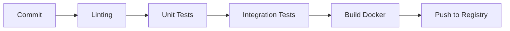

# Release Management - CodingSoft Open WebUI

## 📋 Resumen del Sistema de Versionado

Este documento describe el sistema de versionado, packaging y release del proyecto CodingSoft Open WebUI.

### 🔢 Sistema de Versionado

**Versión Actual:** `0.7.2`

**Formato:** `MAJOR.MINOR.PATCH`

- **MAJOR (0)**: Cambios incompatibles con la API
- **MINOR (7)**: Nuevas funcionalidades compatibles
- **PATCH (2)**: Correcciones de bugs compatibles

---

## 📦 Estructura de Packaging

### Frontend (NPM/Node.js)

**Archivo:** `package.json`

```json
{
  "name": "codingsoft-open-webui",
  "version": "0.7.2",
  "private": true,
  "scripts": {
    "dev": "npm run pyodide:fetch && vite dev --host",
    "build": "npm run pyodide:fetch && vite build",
    "lint": "npm run lint:frontend ; npm run lint:types ; npm run lint:backend",
    "test:frontend": "vitest --passWithNoTests"
  }
}
```

**Tecnologías:**
- Framework: SvelteKit 2.5
- Build Tool: Vite 5.4
- TypeScript: 5.5
- Testing: Vitest + Cypress

### Backend (Python)

**Archivo:** `pyproject.toml`

```toml
[project]
name = "codingsoft-open-webui"
description = "CodingSoft Open WebUI"
version = "0.7.2"
dependencies = [
    "fastapi==0.128.0",
    "uvicorn[standard]==0.40.0",
    "pydantic==2.12.5",
    # ... más dependencias
]
```

**Tecnologías:**
- Framework: FastAPI 0.128
- Server: Uvicorn 0.40
- Database: SQLite + SQLAlchemy 2.0
- Testing: Pytest

---

## 🚀 Sistema de Releases

### Workflows de GitHub Actions

#### 1. Release a PyPI (`.github/workflows/release-pypi.yml`)

```yaml
name: Release to PyPI

on:
  push:
    branches:
      - main
      - pypi-release

jobs:
  release:
    runs-on: ubuntu-latest
    permissions:
      id-token: write
    steps:
      - uses: actions/checkout@v5
        with:
          fetch-depth: 0
      
      - uses: actions/setup-node@v5
        with:
          node-version: 22
      
      - uses: actions/setup-python@v6
        with:
          python-version: 3.11
      
      - name: Build
        run: |
          pip install build
          python -m build .
      
      - uses: pypa/gh-action-pypi-publish@release/v1
```

**Características:**
- Publica automáticamente a PyPI
- Requiere push a ramas `main` o `pypi-release`
- Usa Trusted Publishing de PyPI

#### 2. Docker Build (`.github/workflows/docker-build.yaml`)

Construye imágenes Docker para múltiples plataformas:
- `ghcr.io/codingsoft/open-webui:main`
- `ghcr.io/codingsoft/open-webui:cuda`
- `ghcr.io/codingsoft/open-webui:ollama`

**Variantes de Build:**
- **Slim**: Versión mínima sin modelos de embedding
- **CUDA**: Con soporte para GPU NVIDIA
- **Ollama**: Con servidor Ollama integrado
- **AMDGPU**: Con soporte para GPU AMD

---

## 🐳 Imágenes Docker

### Sistema de Tagged

```bash
# Tags semánticos
ghcr.io/codingsoft/open-webui:v0.7.2          # Versión específica
ghcr.io/codingsoft/open-webui:v0.7            # Versión menor
ghcr.io/codingsoft/open-webui:v0              # Versión mayor
ghcr.io/codingsoft/open-webui:latest          # Latest estable

# Tags de características
ghcr.io/codingsoft/open-webui:main            # Rama principal
ghcr.io/codingsoft/open-webui:dev             # Desarrollo
ghcr.io/codingsoft/open-webui:cuda            # Con CUDA
ghcr.io/codingsoft/open-webui:ollama          # Con Ollama
ghcr.io/codingsoft/open-webui:slim            # Minimal

# Tags de commit
ghcr.io/codingsoft/open-webui:sha-abc1234     # SHA específico
```

### Construcción de Imágenes

```bash
# Imagen estándar
docker build -t ghcr.io/codingsoft/open-webui:main .

# Con CUDA
docker build \
  --build-arg USE_CUDA=true \
  -t ghcr.io/codingsoft/open-webui:cuda .

# Con Ollama integrado
docker build \
  --build-arg USE_OLLAMA=true \
  -t ghcr.io/codingsoft/open-webui:ollama .

# Slim (minimal)
docker build \
  --build-arg USE_SLIM=true \
  -t ghcr.io/codingsoft/open-webui:slim .
```

### Variables de Entorno Docker

```yaml
# Configuración básica
ENV ENV=prod
ENV PORT=8080

# Modelos de ML
ENV USE_EMBEDDING_MODEL_DOCKER=sentence-transformers/all-MiniLM-L6-v2
ENV USE_RERANKING_MODEL_DOCKER=""
ENV USE_AUXILIARY_EMBEDDING_MODEL_DOCKER=TaylorAI/bge-micro-v2

# URLs
ENV OLLAMA_BASE_URL="/ollama"
ENV OPENAI_API_BASE_URL=""
```

---

## 📝 CHANGELOG

### Formato de Entradas

```markdown
## [0.7.2] - 2026-01-30

### Added
- Nueva funcionalidad X
- Mejora en Y

### Changed
- Actualización de Z
- Optimización de rendimiento

### Fixed
- Corrección de bug en A
- Fix de seguridad en B

### Deprecated
- Funcionalidad C marcada como obsoleta

### Removed
- Eliminación de D
- Cleanup de código E

### Security
- Fix de vulnerabilidad F
- Actualización de dependencias críticas
```

### Proceso de Actualización del CHANGELOG

```bash
# 1. Actualizar versión en package.json
npm version 0.7.3 -m "Release v0.7.3"

# 2. Generar changelog automático
github-changelog-generator \
  --user codingsoft \
  --project open-webui \
  --future-release v0.7.3

# 3. Commit y tag
git add CHANGELOG.md package.json
git commit -m "Release v0.7.3"
git tag -a v0.7.3 -m "Release v0.7.3"

# 4. Push
git push origin main --tags
```

---

## 🔧 Scripts de Build y Release

### make

```makefile
# Ver targets disponibles
make help

# Build de producción
make build

# Tests
make test

# Linting
make lint
```

### Scripts Personalizados

```bash
# start-dev-v2.sh - Entorno de desarrollo
./start-dev-v2.sh

# Build de frontend
npm run build

# Build de backend (PyPI)
python -m build .

# Publicar a PyPI
twine upload dist/*
```

---

## 📊 Estrategias de Versionado

### Versiones de Soporte

| Versión | Estado | Soporte |
|---------|--------|---------|
| 0.7.x | Actual | 6 meses |
| 0.6.x | LTS | 12 meses |
| 0.5.x | Legacy | Solo parches críticos |

### Plan de Releases

```
Q1 2026:
├── v0.7.2 (Actual) - Bug fixes
├── v0.8.0 (Planificado) - Nuevas funcionalidades
└── v0.6.1 LTS - Solo seguridad

Q2 2026:
├── v0.8.1 - Actualización menor
└── v0.9.0 - Preparación para v1.0
```

---

## 🧪 Testing y Quality Assurance

### Pipeline de Testing



### Tipos de Tests

1. **Unit Tests (Frontend)**
   ```bash
   npm run test:frontend  # Vitest
   npx cypress run        # E2E
   ```

2. **Unit Tests (Backend)**
   ```bash
   pytest backend/open_webui/test/
   pytest backend/open_webui/test/apps/webui/routers/
   ```

3. **Integration Tests**
   ```bash
   npm run test:integration
   ```

---

## 🔒 Seguridad en Releases

### Firmado de Imágenes

```bash
# Firmar con Cosign
cosign sign --key cosign.key ghcr.io/codingsoft/open-webui:v0.7.2

# Verificar firma
cosign verify ghcr.io/codingsoft/open-webui:v0.7.2
```

### Escaneo de Vulnerabilidades

```bash
# Trivy
trivy image ghcr.io/codingsoft/open-webui:v0.7.2

# Snyk
snyk container test ghcr.io/codingsoft/open-webui:v0.7.2
```

### Políticas de Retención

- **Imágenes de release**: Mantener permanentemente
- **Imágenes de CI**: Eliminar después de 30 días
- **Tags antiguos**: Mantener últimos 5

---

## 📦 Dependencias Críticas

### Frontend

| Dependencia | Versión | Propósito |
|-------------|---------|-----------|
| Svelte | 5.0.0 | Framework UI |
| Vite | 5.4.21 | Build tool |
| TypeScript | 5.5.4 | Tipado |
| TailwindCSS | 4.0.0 | Estilos |

### Backend

| Dependencia | Versión | Propósito |
|-------------|---------|-----------|
| FastAPI | 0.128.0 | Framework web |
| Uvicorn | 0.40.0 | Server ASGI |
| SQLAlchemy | 2.0.45 | ORM |
| Pydantic | 2.12.5 | Validación |

---

## 🚀 Checklist de Release

### Pre-Release

- [ ] Tests pasan (`npm run test`, `pytest`)
- [ ] Linting pasa (`npm run lint`)
- [ ] Build exitoso (`npm run build`)
- [ ] CHANGELOG actualizado
- [ ] Versión actualizada en `package.json`
- [ ] Versión actualizada en `pyproject.toml`
- [ ] Documentación actualizada
- [ ] Security audit pasado

### Durante Release

- [ ] Crear tag de release
- [ ] Build de imágenes Docker
- [ ] Escaneo de vulnerabilidades
- [ ] Firmado de imágenes (Cosign)
- [ ] Push a registry

### Post-Release

- [ ] Verificar imágenes en registry
- [ ] Notificar a usuarios
- [ ] Actualizar docs
- [ ] Monitorear errores post-release

---

## 📚 Referencias

- [Semantic Versioning](https://semver.org/)
- [PyPI Publishing](https://packaging.python.org/en/latest/guides/publishing-package-distribution-uses-pyip/)
- [Docker Buildx](https://docs.docker.com/buildx/working-with-buildx/)
- [GitHub Actions](https://docs.github.com/en/actions)
- [Cosign](https://docs.sigstore.dev/cosign/overview/)

---

**Última actualización:** 2026-01-30
**Versión del documento:** 1.1.0

---

## 🐳 GitHub Container Registry (ghcr.io)

### Acerca del Container Registry

El **Container registry** almacena imágenes Docker y OCI dentro de tu organización o cuenta personal.

**Características:**
- Almacenamiento de imágenes de contenedor dentro de la organización
- Permisos granulares independientes del repositorio
- Imágenes públicas accesibles de forma anónima
- Soporte para Docker Image Manifest V2 y OCI

### Formatos Soportados

- **Docker Image Manifest V2, modelo 2**
- **Open Container Initiative (OCI)**

### Límites

| Recurso | Límite |
|---------|---------|
| Tamaño por capa | 10 GB |
| Timeout de upload | 10 minutos |

---

### Autenticación

#### 1. Con Personal Access Token (Classic)

```bash
# Crear token en GitHub
# Settings → Developer settings → Personal access tokens → Tokens (classic)
# Scopes: write:packages, delete:packages

# Guardar token
export CR_PAT=ghp_tu_token_aqui

# Login en GHCR
echo $CR_PAT | docker login ghcr.io -u codingsoft --password-stdin
```

#### 2. En GitHub Actions (Recomendado)

```yaml
# .github/workflows/docker-publish.yml
name: Docker Publish

on:
  push:
    branches: [main]
    tags: ['v*']

permissions:
  contents: read
  packages: write

jobs:
  docker:
    runs-on: ubuntu-latest
    steps:
      - name: Checkout
        uses: actions/checkout@v4
      
      - name: Set up Docker Buildx
        uses: docker/setup-buildx-action@v3
      
      - name: Login to GHCR
        uses: docker/login-action@v3
        with:
          registry: ghcr.io
          username: ${{ github.actor }}
          password: ${{ secrets.GITHUB_TOKEN }}
      
      - name: Build and push
        uses: docker/build-push-action@v5
        with:
          context: .
          push: true
          tags: ghcr.io/codingsoft/open-webui:${{ github.ref_name }}
```

---

### Imágenes CodingSoft

#### URL del Registro

```
ghcr.io/codingsoft/open-webui
```

#### Estructura de Tags

```bash
# Tags semánticos estándar
ghcr.io/codingsoft/open-webui:v0.7.2
ghcr.io/codingsoft/open-webui:v0.7
ghcr.io/codingsoft/open-webui:v0

# Tags de ramas
ghcr.io/codingsoft/open-webui:main
ghcr.io/codingsoft/open-webui:dev

# Tags de características
ghcr.io/codingsoft/open-webui:cuda
ghcr.io/codingsoft/open-webui:ollama
ghcr.io/codingsoft/open-webui:slim

# Tags de commit
ghcr.io/codingsoft/open-webui:sha-abc1234

# Tags latest
ghcr.io/codingsoft/open-webui:latest
```

#### Metadatos OCI (Etiquetas)

```dockerfile
# En Dockerfile
LABEL org.opencontainers.image.source="https://github.com/codingsoft/open-webui"
LABEL org.opencontainers.image.description="CodingSoft Open WebUI - Interfaz de usuario moderna para LLMs"
LABEL org.opencontainers.image.licenses="MIT"
LABEL org.opencontainers.image.version="0.7.2"
```

---

### Gestión de Imágenes

#### Subir Imágenes

```bash
# 1. Construir imagen
docker build -t ghcr.io/codingsoft/open-webui:v0.7.2 .

# 2. Etiquetar (si ya existe)
docker tag 38f737a91f39 ghcr.io/codingsoft/open-webui:v0.7.2

# 3. Subir
docker push ghcr.io/codingsoft/open-webui:v0.7.2

# 4. Subir múltiples tags
docker tag ghcr.io/codingsoft/open-webui:v0.7.2 ghcr.io/codingsoft/open-webui:latest
docker push ghcr.io/codingsoft/open-webui:latest
```

#### Descargar Imágenes

```bash
# Por nombre y tag
docker pull ghcr.io/codingsoft/open-webui:v0.7.2

# Por digest (asegura reproducibilidad)
docker pull ghcr.io/codingsoft/open-webui@sha256:82jf9a84u29...

# Latest
docker pull ghcr.io/codingsoft/open-webui:latest
```

#### Listar Imágenes

```bash
# Ver imágenes locales
docker images | grep ghcr.io

# Ver digest
docker inspect ghcr.io/codingsoft/open-webui:v0.7.2 --format='{{.Id}}'
```

#### Eliminar Imágenes

```bash
# Local
docker rmi ghcr.io/codingsoft/open-webui:v0.7.2

# En GHCR (requiere token con delete:packages)
docker rmi ghcr.io/codingsoft/open-webui:v0.7.2
```

---

### Permisos y Visibilidad

#### Configurar Visibilidad

```bash
# Privada (default)
# Solo usuarios con permisos pueden acceder

# Pública
# Accessible públicamente
```

#### Conectar a Repositorio

 Recomendado: Publicar desde GitHub Actions

```yaml
# El repositorio se vincula automáticamente
- name: Build and push
  uses: docker/build-push-action@v5
  with:
    push: true
    tags: ghcr.io/codingsoft/open-webui:${{ github.ref_name }}
```

**O usando etiquetas:**

```dockerfile
LABEL org.opencontainers.image.source="https://github.com/codingsoft/open-webui"
```

---

### Ejemplo Completo: Pipeline de Release

```yaml
# .github/workflows/release.yml
name: Release

on:
  push:
    tags:
      - 'v*'

jobs:
  release:
    runs-on: ubuntu-latest
    permissions:
      packages: write
      contents: read
    
    steps:
      - name: Checkout
        uses: actions/checkout@v4
        with:
          fetch-depth: 0
      
      - name: Set up Docker Buildx
        uses: docker/setup-buildx-action@v3
      
      - name: Extract version
        id: version
        run: echo "VERSION=${GITHUB_REF#refs/tags/v}" >> $GITHUB_OUTPUT
      
      - name: Login to GHCR
        uses: docker/login-action@v3
        with:
          registry: ghcr.io
          username: ${{ github.actor }}
          password: ${{ secrets.GITHUB_TOKEN }}
      
      - name: Metadata
        id: meta
        uses: docker/metadata-action@v5
        with:
          images: ghcr.io/codingsoft/open-webui
          tags: |
            type=semver,pattern={{version}}
            type=semver,pattern={{major}}.{{minor}}
            type=semver,pattern={{major}}
            type=ref,event=branch
            type=raw,value=latest,enable={{-is_default_branch}}
      
      - name: Build and push
        uses: docker/build-push-action@v5
        with:
          context: .
          push: true
          tags: ${{ steps.meta.outputs.tags }}
          labels: ${{ steps.meta.outputs.labels }}
          build-args: |
            BUILD_HASH=${{ steps.version.outputs.VERSION }}
```

---

### Docker Compose con GHCR

```yaml
# docker-compose.yml
version: '3.8'

services:
  webui:
    image: ghcr.io/codingsoft/open-webui:latest
    container_name: codingsoft-webui
    ports:
      - "3000:8080"
    environment:
      - OLLAMA_BASE_URL=http://ollama:11434
    volumes:
      - webui-data:/app/backend/data
    restart: unless-stopped

  ollama:
    image: ollama/ollama:latest
    container_name: codingsoft-ollama
    volumes:
      - ollama-data:/root/.ollama
    restart: unless-stopped

volumes:
  webui-data:
  ollama-data:
```

---

### Seguridad

#### Firmado con Cosign

```bash
# Instalar Cosign
brew install cosign

# Generar keys
cosign generate-key-pair

# Firmar imagen
cosign sign --key cosign.key ghcr.io/codingsoft/open-webui:v0.7.2

# Verificar
cosign verify ghcr.io/codingsoft/open-webui:v0.7.2
```

#### Escaneo de Vulnerabilidades

```bash
# Trivy
trivy image ghcr.io/codingsoft/open-webui:v0.7.2

# Guardar reporte
trivy image --format json --output report.json ghcr.io/codingsoft/open-webui:v0.7.2
```

---

### Troubleshooting

| Problema | Solución |
|----------|----------|
| "unauthorized" | Verificar token y permisos |
| "denied" | Revisar visibilidad del paquete |
| "layer exceeds limit" | Capas > 10GB no soportadas |
| "timeout" | Upload > 10 minutos, usar chunked |

**Última actualización:** 2026-01-30
**Versión del documento:** 1.1.0
</contents>